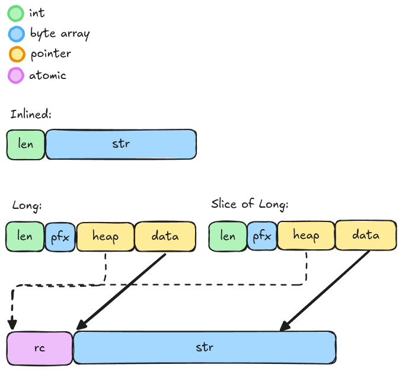

# byteview

An immutable byte slice that may be inlined, and can be partially cloned without heap allocation.

## Memory usage

Allocating 200M "helloworld" (len=10) strings:

|  Struct         | Memory Usage |
|-----------------|--------------|
| `Arc<[u8]>`     | 12.8 GB      |
| `tokio::Bytes`  | 12.8 GB       |
| `ByteView`     | 4.8 GB       |

Allocating 100M "helloworldhelloworld" (len=20) strings:

|  Struct         | Memory Usage |
|-----------------|--------------|
| `Arc<[u8]>`     | 6.4 GB       |
| `tokio::Bytes`  | 6.4 GB       |
| `ByteView`     | 2.4 GB       |

Allocating 500k `"helloworld".repeat(1000)` (len=1000) strings:

|  Struct         | Memory Usage |
|-----------------|--------------|
| `Arc<[u8]>`     | 5 GB       |
| `tokio::Bytes`  | 5 GB       |
| `ByteView`     | 5 GB       |
